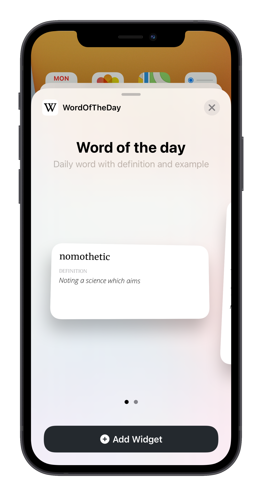
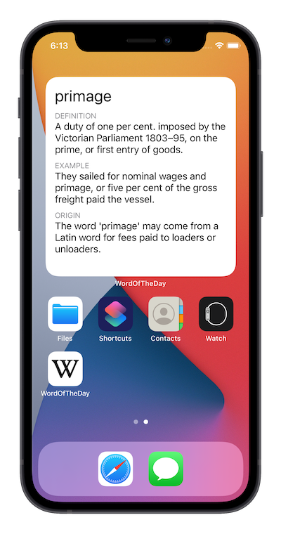
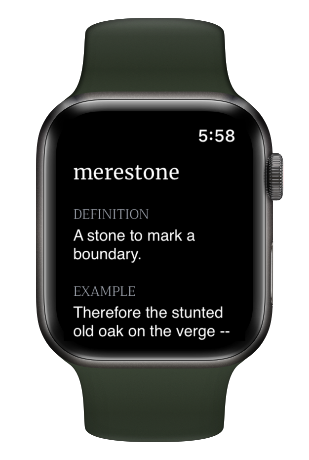

# Word Of The Day
   

   

    iOS Widget and WatchOS app made in SwiftUI that displays a random word of the day with description and example of usuage.
  

 

  

  
  
  
  

## Requirements

- iOS 14.0+
- Xcode 12.0+

## Contribute

If you have feature requests or bug reports, feel free to help out by sending pull requests or by [creating new issues](https://github.com/kyledold/WordOfTheDay/issues/new). 

Please take a moment to
review the [CONTRIBUTING](.github/CONTRIBUTING.md) guidelines.
    
## Third-Party Libraries

This project uses [AlamoFire](https://github.com/Alamofire/Alamofire) to handle network requests.

## Data

The data for the project comes for [Wordnik](https://www.wordnik.com/) and you will need to request an API key from them and then reference it in the NetworkKit layer.

## License

"Word Of The Day" is released under the MIT license. See [LICENSE](mit) for details.

[https://github.com/kyledold](/)

[swift-image]:https://img.shields.io/badge/swift-5.0-orange.svg
[swift-url]: https://swift.org/
[license-image]: https://img.shields.io/badge/License-MIT-blue.svg
[license-url]: LICENSE
